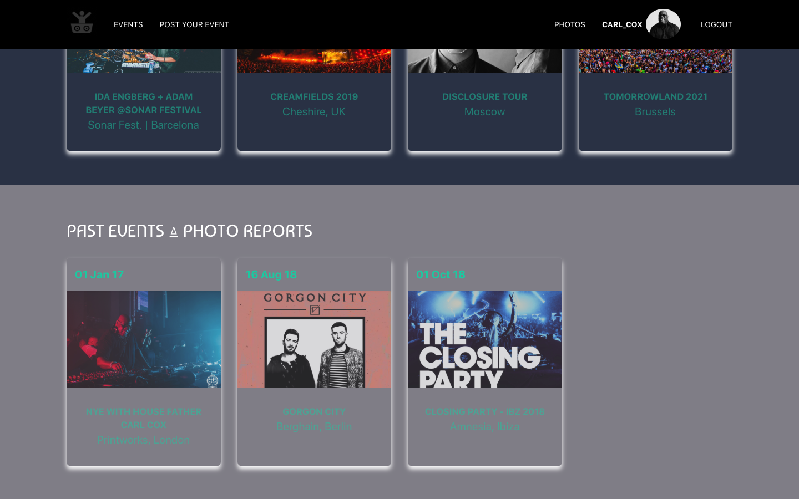

# WDI-Project 04 - Final Project : Full stack app

## Goal: Creating a full stack API app

## Technologies used

* HTML5
* CSS3
* SASS
* Flask
* Python
* PostgreSQL database
* React.js
* Javascript
* GitHub
* Bulma
* Heroku

## My app - Clubbing Messe

### App overview
Clubbing Messe is a a community platform that allows users to share events and photos of Electronic music events worldwide.
The users can:
* Register
* Login
* EVENTS: create, post, comment, comment other users' EVENTS
* Attend events
* PHOTOS : post its own photos to past events

### App views
1. Home page

The user can see 2 separate sections: UPCOMING events and PAST EVENTS/ PHOTO report

2. Show a specific event

When the user clicks on any event, he/she will access to a page with different sections: Infos | Attendees | Comments | Post his/her own pictures of the event.
The details are auto-populated on the right side of the image.
Once the ATTEND button is clicked, the thumbnail of his image profile will appear in the "Members attending" section.

Any user can comment:

Any user can post the photos related to the event. I added a zoom effect, when the user hover a picture.

3. Post your event page
The user can post his event by clicking on the "Post your event" link from the navbar.

4. Show a user profile

By clicking on any username, from any page, we can access to other users' profile. The user can access his own profile from the navbar by clicking on his name.

### Process

  * Designing wireframes
  * Setting up Flask back-end with Python
  * Creating + seeding database
  * Coding the front-end side using React.js: paths, links, structure etc ...
  * Searched online for the icons, images
  * Styling with CSS, Bulma    
  * ALL ALONG: Testing and fixing bugs

### Challenges

Working with a SQL database requires a certain knowledge and is less straight-forward than Mongo.
Also, I needed to understand the big picture to be able to solve problems. Populating the database info on the front-end caused a couple of errors.

### Wins

I managed to solve many bugs and got a better understanding of React.js and SQL.
I really enjoyed coding with Python and setting up / updating the SQL database.
I'm quite pleased with the design and look of the app.

## Future features

I would like to add these missing features:
    * Like button
    * Edit profile
    * On the profile page: Auto-populate "attending events"
    * Add an administrator profile to validate the posted pictures
    * Add some logic to remove the "post your pics" from the upcoming events
    * "Post videos"
